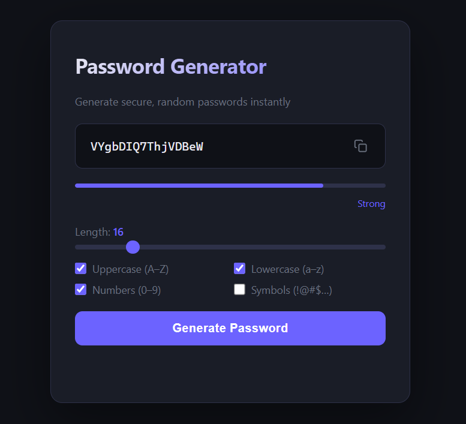

# Password Generator

A fast, secure, browser-based password generator with no dependencies.

**[Live Demo](https://kausal-dev.github.io/password-generator/)**



## Features

- Cryptographically secure randomness via the Web Crypto API
- Adjustable length from 6 to 64 characters
- Toggle character sets: uppercase, lowercase, numbers, and symbols
- Live password strength meter (Weak → Very Strong)
- One-click copy to clipboard
- Fully responsive dark UI — no frameworks, no build step

## Getting Started

```bash
git clone https://github.com/Kausal-dev/password-generator.git
cd password-generator
# Open index.html in your browser — that's it
```

## Tech Stack

- HTML5
- CSS3 (custom properties, CSS Grid)
- Vanilla JavaScript (Web Crypto API)

## License

MIT
